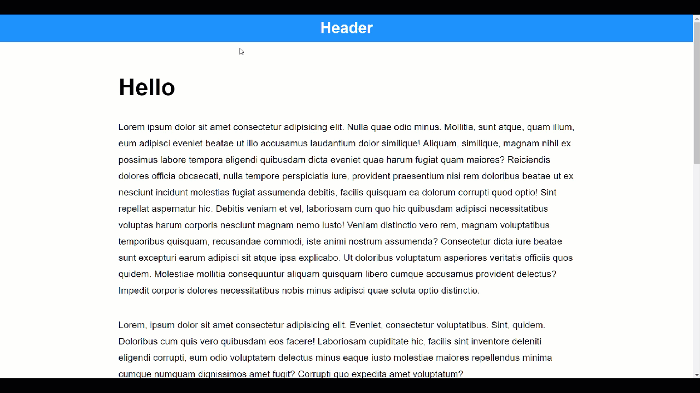

# Hide/Show Header
Hide/Show header on scroll.

### [DEMO](https://aprather51.github.io/Hide-Show-Header/)
## Features
- React
- Sass

### 
A close resemblance with Kyle Matthew's [ react-headroom](https://github.com/KyleAMathews/react-headroom) without need to import this dependency.

This was my personal experiment achieved by using React lifecycle, state management, and css/scss.

## Author
Arthur Prather, Jr — [@aprather51](https://github.com/aprather51)

## License
This project available under the [MIT LICENSE](LICENSE.md)

